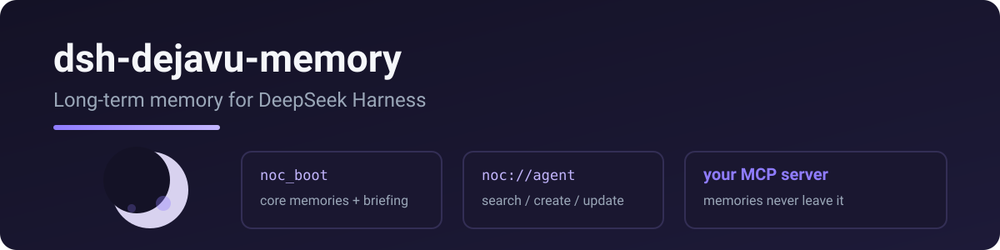

<p align="center">
  
</p>

# dsh-dejavu-memory

> **Renamed:** former npm/GitHub package `dsh-noc-memory` → **`dsh-dejavu-memory`**. Prefer this package; deprecate the old name when publishing.


Connects DeepSeek Harness to **DejaVu**: session-start boot + daily briefing, plus memory read / search / create / update / delete, backed by your own DejaVu MCP server on Cloudflare.

> Port of [pi-dejavu-memory](https://github.com/RealAlexandreAI/pi-dejavu-memory) — same protocol, same tool names.

[English](README.md) · [中文](README.zh.md)

## Tools

| tool | what it does |
|---|---|
| `noc_boot` | load at session start: `system://boot`, `system://recent/5`, `system://triggers`, then best-effort `system://briefing`; afterward read `system://focus` (recent is a briefing subset — no need to re-read it after boot) |
| `noc_read` | read a memory by URI (`system://…`, `noc://agent`, …) |
| `noc_search` | search memories (semantic + keyword / trigger recall via `search_memory`) |
| `noc_create` | create a memory node (`[Baseline]`/`[Deviation]`/`[Result]`/`[Reusable judgment]`) |
| `noc_update` | full replace, patch (old_string/new_string), or append; optional `relation` |
| `noc_delete` | delete a memory by URI (`delete_memory`) |

## Quick start

```sh
dsh plugin --profile web add dsh-dejavu-memory
```

Requires your own DejaVu server — deploy it to Cloudflare in minutes: [DejaVu](https://github.com/RealAlexandreAI/DejaVu).

```yaml
- id: dejavu
  name: dsh-dejavu-memory
  config:
    mcp_url: https://dejavu.example.com/mcp
    mcp_auth: ""  # prefer mcp_headers for Access service token
```

For a server behind Cloudflare Access (e.g. dejavu.example.com), use the **service token** headers instead of `mcp_auth`:

```yaml
- id: dejavu
  name: dsh-dejavu-memory
  config:
    mcp_url: https://dejavu.example.com/mcp
    mcp_headers:
      CF-Access-Client-Id: <your client id>
      CF-Access-Client-Secret: <your client secret>
```

| key | required | meaning |
|---|---|---|
| `mcp_url` | yes | your DejaVu MCP endpoint (Streamable HTTP) |
| `mcp_auth` | no | legacy; prefer `mcp_headers` for Cloudflare Access service token |
| `mcp_headers` | no | extra headers merged into every MCP request (e.g. Cloudflare Access service token) |

> **Upgrading from dsh-noc-memory:** package renamed to `dsh-dejavu-memory`. Remove the old plugin and re-add; point config `id` at `dejavu`.

## Why noc_* (not DejaVu_*)?

Some agents probe `read_mcp_resource` before reaching for a memory tool, wasting a round trip ([upstream issue #32](https://github.com/Dataojitori/DejaVu_memory/issues/32)). Explicit `noc_boot` / `noc_read` naming in the tool list and boot-protocol prompt steers models straight to the right tool — no resource shim required.

## License

MIT

## Related

- [DejaVu](https://github.com/RealAlexandreAI/DejaVu) — the Cloudflare MCP memory server this plugin talks to
- [pi-dejavu-memory](https://github.com/RealAlexandreAI/pi-dejavu-memory) — same memory tools for Pi
- [DejaVu_memory](https://github.com/Dataojitori/DejaVu_memory) — upstream project
