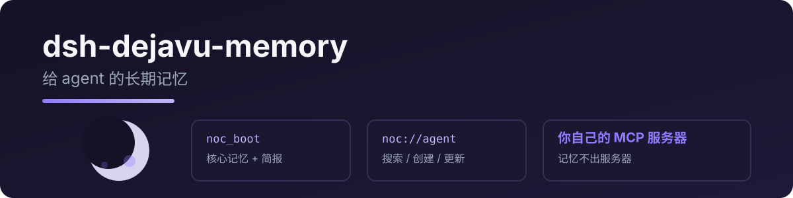

<p align="center">
  
</p>

# dsh-dejavu-memory

给 DeepSeek Harness 接上 **DejaVu** 长期记忆:会话开始 boot + 每日简报,记忆读写/搜索/更新/删除,后端是部署在 Cloudflare 上的 DejaVu MCP 服务器。

> 由 [pi-dejavu-memory](https://github.com/RealAlexandreAI/pi-dejavu-memory) 移植,协议与工具名完全一致。

[English](README.md) · [中文](README.zh.md)

## 工具

| 工具 | 说明 |
|---|---|
| `noc_boot` | 会话开始加载：`system://boot`、`system://recent/5`、`system://triggers`，再 best-effort 读 `system://briefing`；随后读 `system://focus`（`recent` 是 briefing 子集——boot 之后不必再单独读） |
| `noc_read` | 按 URI 读记忆(`system://…`、`noc://agent`…) |
| `noc_search` | 搜记忆(语义 + 关键词 / 触发词召回，服务端 `search_memory`) |
| `noc_create` | 新建记忆节点(支持 `[Baseline]`/`[Deviation]`/`[Result]`/`[Reusable judgment]`) |
| `noc_update` | 全文替换、patch(old_string/new_string)或 append;可选 `relation` |
| `noc_delete` | 按 URI 删除记忆(`delete_memory`) |

## 快速开始

```sh
dsh plugin --profile web add dsh-dejavu-memory
```

需要你能连到自己的 DejaVu（DejaVu）服务器——几分钟部署到 Cloudflare:[DejaVu](https://github.com/RealAlexandreAI/DejaVu)。

```yaml
- id: dejavu
  name: dsh-dejavu-memory
  config:
    mcp_url: https://dejavu.example.com/mcp
    mcp_auth: ""  # 优先用 mcp_headers 传 Access service token
```

若服务器在 Cloudflare Access 后（例如 `dejavu.example.com`），用 **service token** 头替代 `mcp_auth`：

```yaml
- id: dejavu
  name: dsh-dejavu-memory
  config:
    mcp_url: https://dejavu.example.com/mcp
    mcp_headers:
      CF-Access-Client-Id: <your client id>
      CF-Access-Client-Secret: <your client secret>
```

| 键 | 必填 | 含义 |
|---|---|---|
| `mcp_url` | 是 | 你的 DejaVu MCP 端点(Streamable HTTP) |
| `mcp_auth` | 否 | 遗留字段；优先用 `mcp_headers` 传 Cloudflare Access service token |

> **从 dsh-DejaVu-memory(≤0.1.x)升级:** 已改名为 `dsh-dejavu-memory`,工具名 `DejaVu_*` → `noc_*`。删除旧插件后重新添加新包;更新提示词里所有 `DejaVu_*` 工具引用。

## 为什么叫 noc_*(不叫 DejaVu_*)?

部分模型会先探测 `read_mcp_resource` 再调用记忆工具,浪费一次往返([上游 issue #32](https://github.com/Dataojitori/DejaVu_memory/issues/32))。工具列表与 boot 协议提示词里显式的 `noc_boot` / `noc_read` 命名,能把模型直接引导到正确工具——无需 resource 兼容层。

## License

MIT

## 相关

- [DejaVu](https://github.com/RealAlexandreAI/DejaVu) — 本插件连接的 Cloudflare MCP 记忆服务器
- [pi-dejavu-memory](https://github.com/RealAlexandreAI/pi-dejavu-memory) — 面向 Pi 的同一套记忆工具
- [DejaVu_memory](https://github.com/Dataojitori/DejaVu_memory) — 上游项目
